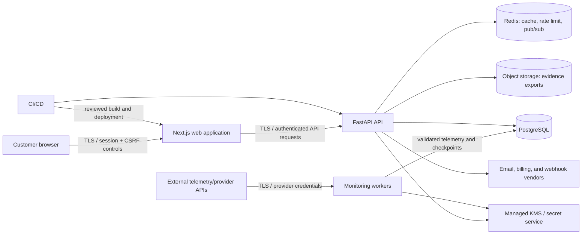

# Architecture, Data Flow, and Threat Model

**Owner:** Application Security Owner
**Review trigger:** material changes to authentication, trust boundaries, storage, providers, cryptography, or customer-data flow

This customer-facing summary complements the detailed repository architecture in `docs/architecture.md` and the tenant-isolation analysis in `docs/MULTI_TENANT_ISOLATION.md`.

## System context and trust boundaries

Trust boundaries are: the customer endpoint/browser, public edge, application runtime, worker/provider ingress, authoritative data stores, managed secrets/keys, third-party processors, and CI/CD control plane. PostgreSQL is authoritative; Redis and browser state are not. Demo/simulator data must never satisfy live-workspace evidence claims.

## Data-flow inventory

| Flow | Data | Security expectations |
|---|---|---|
| Browser to web/API | Identity, workspace requests, configuration, findings, incident actions | TLS, secure session handling, CSRF defense, workspace RBAC, rate limiting, no secrets in browser logs |
| Provider to worker | Chain/provider telemetry and checkpoints | TLS, provider credential protection, schema validation, provenance labels, idempotency, fail closed on insufficient live evidence |
| API/worker to PostgreSQL | Tenant records, telemetry, alerts, incidents, audit and governance records | Encryption in transit/at rest by provider, least-privilege DB role, tenant predicates, constraints, backups/PITR, audit integrity |
| API to Redis | Ephemeral rate limit, cache, revocation/pub-sub support | No authoritative evidence, bounded TTL, authentication/TLS in production, safe degradation |
| API to object storage | Evidence/export files and manifests | Private bucket, encryption, versioning/Object Lock where configured, signed integrity metadata, scoped download authorization |
| API to external vendors | Minimum billing/email/webhook payload | Approved vendor, minimized fields, TLS, scoped secret, retries/idempotency, delivery audit |
| Runtime to KMS/secrets | Key identifiers and cryptographic operations/secrets | Workload identity, least privilege, audit logging, rotation, no plaintext persistence/logging |

## Data classifications

1. **Restricted:** production secrets, private keys, password/session material, security findings, raw auditor evidence.
2. **Confidential customer data:** identity/contact data, workspace configuration, telemetry linked to a customer, incidents, evidence exports, billing metadata.
3. **Internal:** operational metrics, non-sensitive configuration, internal procedures.
4. **Public:** approved product/security documentation and status communications.

Customer data is logically segregated by workspace identifiers and authorization checks. Production data must not be copied to demo/test environments without documented approval and appropriate de-identification.

## Threat model

| Threat | Primary controls | Residual-risk/evidence focus |
|---|---|---|
| Account takeover/session theft | MFA expectation for privileged access, secure sessions, CSRF, revocation, rate limiting, security logging | Production IdP/session configuration and access-log sampling |
| Broken authorization/cross-tenant access | Workspace-scoped RBAC, database relationships, negative tests, least privilege | Maintain tenant-isolation tests and independent penetration-test coverage |
| Injection and unsafe input | Framework parameterization/validation, output encoding, SAST, dependency updates | Review raw SQL, URLs/webhooks, parsers, and export rendering |
| Secret or key exposure | Gitleaks, managed secrets/KMS, least privilege, rotation procedure, log redaction | Provider policy evidence and rotation exercises |
| Supply-chain compromise | Pinned direct dependencies, lock file, dependency audit, SAST, image scan, SBOM, reviewed CI | Add provenance/signing and monitor transitive risk |
| Malicious/compromised telemetry provider | Provenance labels, validation, checkpoints, idempotency, no synthetic-to-live promotion | Provider diversity, anomaly detection, failover exercises |
| Audit/evidence tampering | Hash-chain/signature metadata, immutable/versioned storage target, restricted keys | Validate historical key access and external storage settings |
| Data loss/ransomware | PITR, isolated restore, versioned/replicated exports, least privilege, recovery drills | Collect provider backup evidence and measured RTO/RPO |
| Denial of service/provider outage | Rate limiting, health/SLO monitoring, queue/retry controls, regional/provider runbooks | Capacity testing and operational alert evidence |
| Insider/CI compromise | Unique identities, access review, branch protection, peer approval, audit logs, scoped CI secrets | Repository/provider settings and periodic access certification |
| Third-party breach | Vendor due diligence, data minimization, DPA/breach terms, subprocessor register, credential revocation | Complete vendor evidence and customer notices |
| Retention/deletion failure | Data-class schedules, legal holds, approved deletion workflow, deletion events | Approve production schedules and sample completed requests |

## Security assumptions and limitations

Cloud-region, storage encryption, backup, WAF/edge, DDoS, and vendor configurations are deployment facts and must be evidenced from the production providers. Repository code alone does not prove they are enabled. This threat model is not an independent penetration test and does not establish compliance certification.
